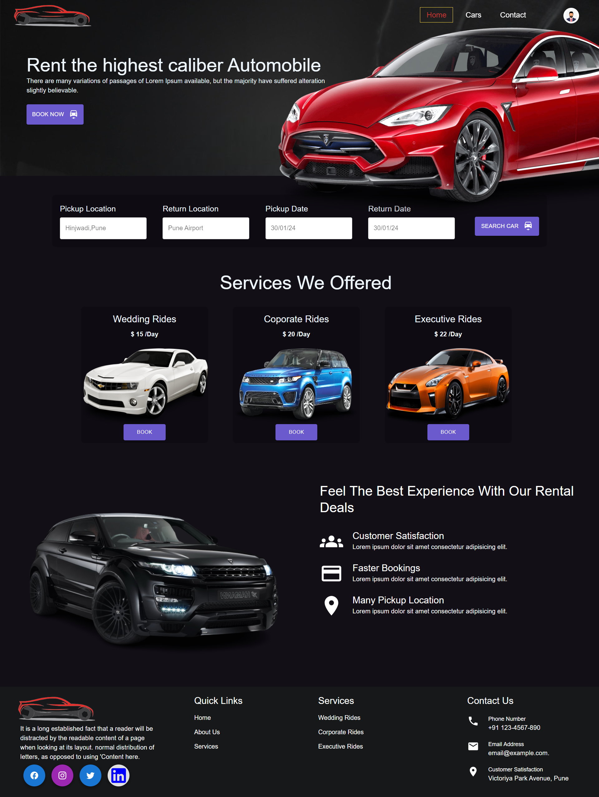
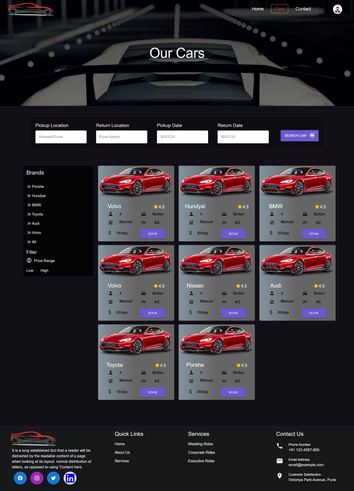
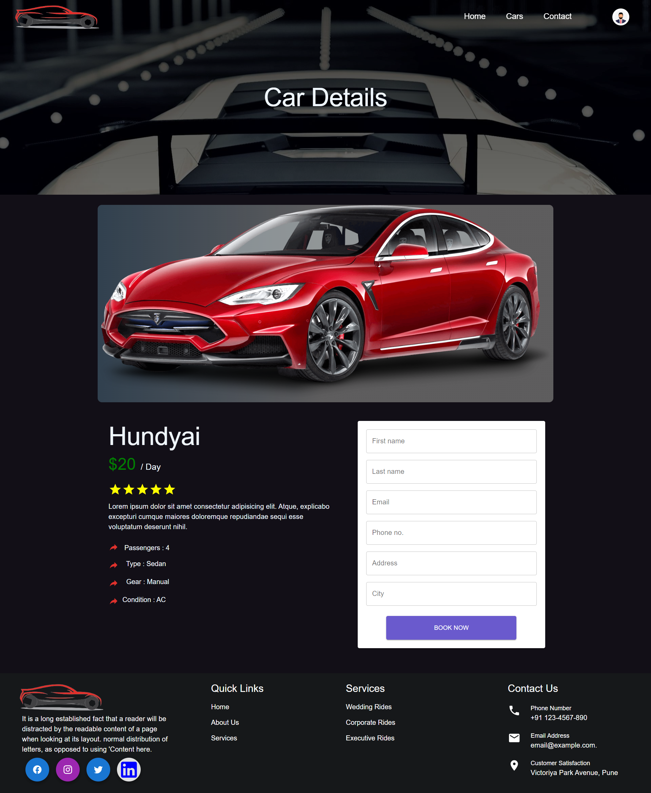
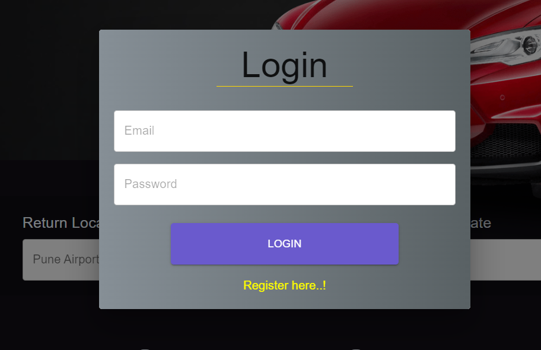
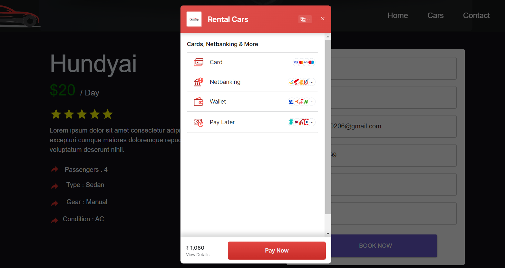
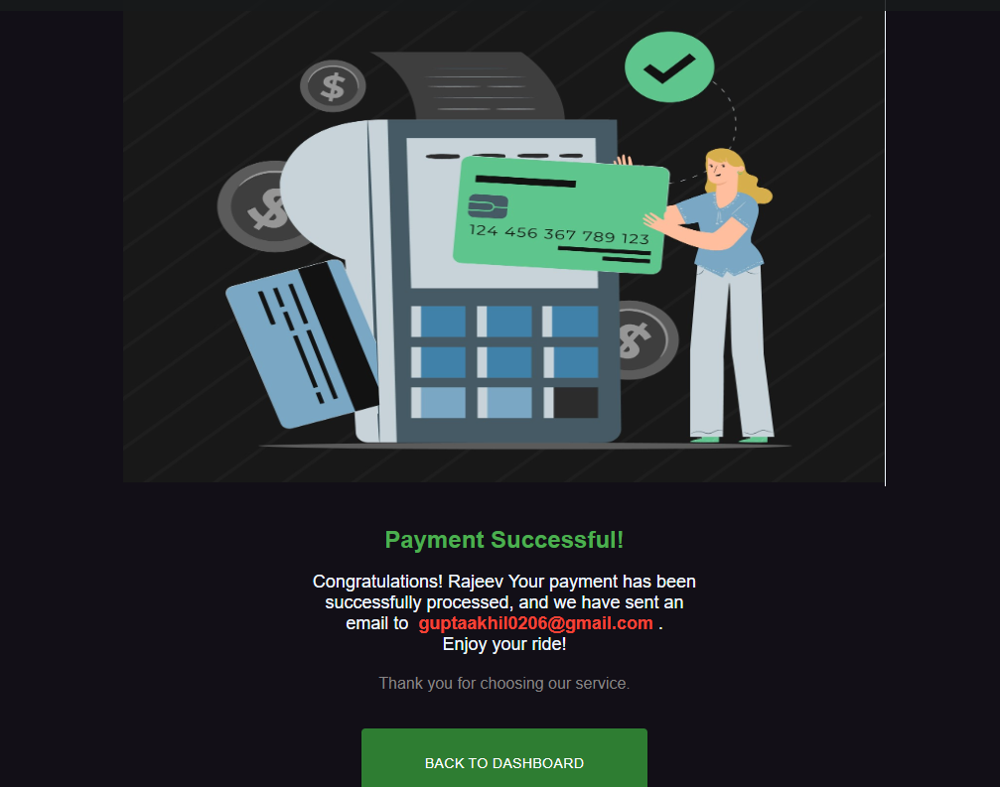
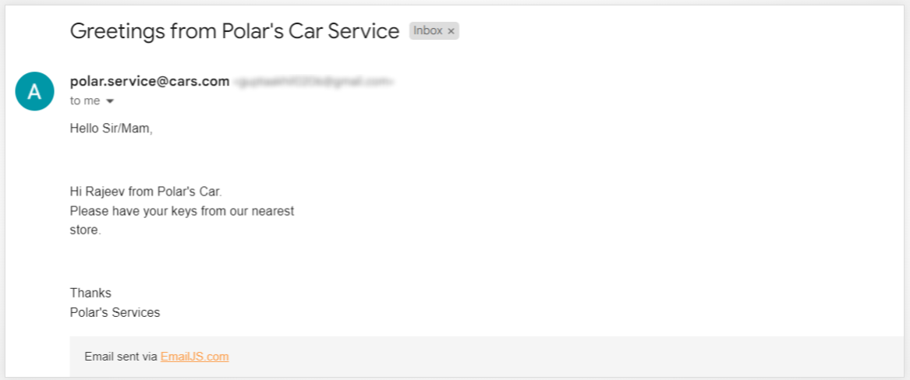
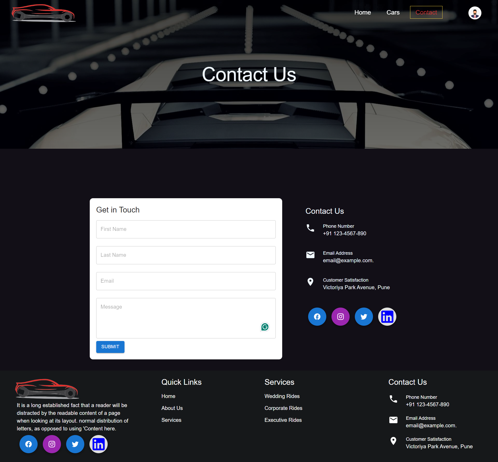

# Automobile Rental Application

Simplify vehicle bookings with our intuitive Automobile Rental Application.Experience smooth and efficient vehicle rentals with our application.\
Enjoy hassle-free vehicle rentals through our user-friendly app. Users can choose/filter cars based on their requirement 

### Key features :
- Application developed using ReactJS.
- Implemented Material UI for design.
- Implemented Firebase for authentication and authorization.
- Integrated Razorpay for seamless payment processing.
- Utilized the Context API for state management within the application.
- After the user completes the payment, a confirmation email is sent.

### Dashboard 

### Our cars

### Car details

### User login

### Book car via RazorPay payment gateway

### Payment Success

### Confirmation Email

### Contact Us

## Getting Started with Create React App 

This project was bootstrapped with [Create React App](https://github.com/facebook/create-react-app).

## Available Scripts

In the project directory, you can run:

### `npm start`

Runs the app in the development mode.\
Open [http://localhost:3000](http://localhost:3000) to view it in your browser.

The page will reload when you make changes.\
You may also see any lint errors in the console.

